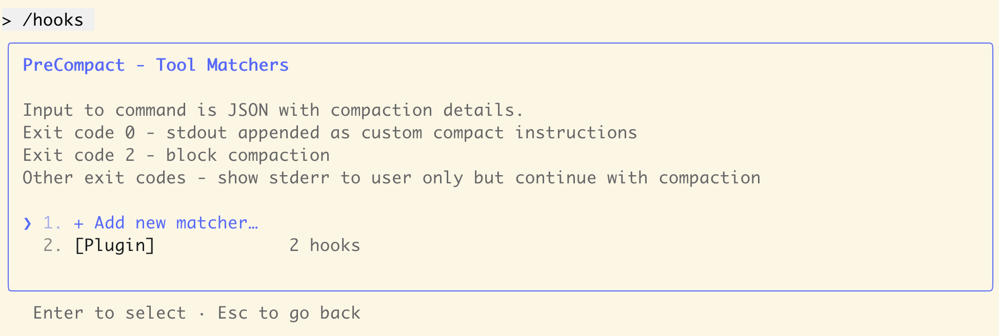

### Preflight Checklist

- [x] I have searched [existing issues](https://github.com/anthropics/claude-code/issues?q=is%3Aissue%20state%3Aopen%20label%3Abug) and this hasn't been reported yet
- [x] This is a single bug report (please file separate reports for different bugs)
- [x] I am using the latest version of Claude Code

### What's Wrong?

When hooks are registered via plugins, they are **executed twice** with different process IDs. This affects all hook types including `SessionStart`, `Notification`, and `PreCompact`.

**Key symptoms:**
- Each hook execution spawns **two separate processes** (different PIDs)
- The `/hooks` command shows duplicate hook registrations (e.g., "2 hooks" when only 1 is defined)
- This has been occurring consistently since the plugin system was implemented
- Both executions actually run (verified via log files with different PIDs)

This is **NOT** a display-only issue - the hooks are genuinely executed twice, causing:
- Duplicate notifications
- Duplicate audio playback (if hooks trigger sounds)
- Duplicate file writes/modifications
- Wasted system resources

### What Should Happen?

Each hook defined in a plugin should be:
1. Registered **once** in the hooks system
2. Displayed **once** in `/hooks` command output
3. Executed **once** when triggered

### Error Messages/Logs

**Log file evidence (`~/claude-hook-duplicate-test.log`):**

```
[2025-11-03 05:19:02.918] Hook: SessionStart | PID: 63864
[2025-11-03 05:19:02.919] Hook: SessionStart | PID: 63865
[2025-11-03 05:19:37.800] Hook: Notification | PID: 64293
[2025-11-03 05:19:37.800] Hook: Notification | PID: 64292
```

**Observations:**
- SessionStart executed twice (PID 63864 and 63865) within 1ms
- Notification executed twice (PID 64292 and 64293) at identical timestamp
- Each pair has **different PIDs**, proving these are separate process executions

**`/hooks` command output:**

Shows "2 hooks" for PreCompact when only 1 hook is defined in the plugin (see attached screenshot).

### Steps to Reproduce

**Reproduction repository:** https://github.com/otolab/hook-duplicate-test-plugin

**Quick reproduction steps:**

1. Install the test plugin:
   ```bash
   /plugin marketplace add otolab/hook-duplicate-test-plugin
   /plugin install hook-duplicate-test@otolab-marketplace
   ```

2. Check hook registration:
   ```bash
   /hooks
   ```
   **Expected:** Each hook type shows "1 hook"
   **Actual:** Shows "2 hooks" (duplicate registration)

3. Clear log file and trigger hooks:
   ```bash
   rm -f ~/claude-hook-duplicate-test.log
   # Start new session (triggers SessionStart)
   # Or trigger notification (triggers Notification)
   ```

4. Check execution log:
   ```bash
   cat ~/claude-hook-duplicate-test.log
   ```
   **Expected:** One entry per hook execution
   **Actual:** Two entries with different PIDs

### Evidence

**Screenshot of `/hooks` command showing duplicate registration:**



As shown in the screenshot, the PreCompact section displays "[Plugin] 2 hooks" even though only one PreCompact hook is defined in the plugin configuration.

### Claude Model

Sonnet (default)

### Is this a regression?

Unknown - this appears to have been present since the plugin system was implemented

### Last Working Version

Unknown

### Claude Code Version

2.0.31 (Claude Code)

### Platform

Anthropic API

### Operating System

macOS

### Terminal/Shell

iTerm2 / Terminal.app

### Additional Information

**Affected hook types (confirmed):**
- SessionStart
- Notification
- PreCompact
- Likely affects all hook types

**Related but different issues:**
- Issue #10777: Skill execution message appears twice (display-only, not actual duplicate execution)
- Issue #6674: Hook navigation infinite loop (UI navigation issue with duplicate entries)

This issue is distinct because it involves **actual duplicate execution** with separate processes, not just display problems.

**Impact:**
- Medium/High severity for production use
- Causes duplicate side effects (notifications, file writes, audio, etc.)
- Wastes system resources
- Has been present since plugin system launch

**Test plugin details:**
- Simple hooks that log timestamp + PID to file
- Demonstrates the issue is in the hook registration/execution system, not in hook implementation
- Repository includes full reproduction instructions
